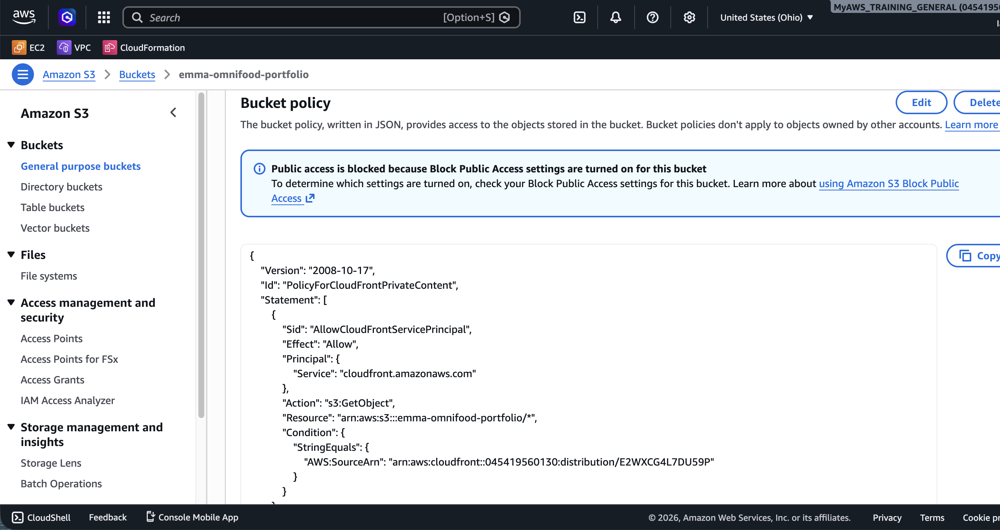

# Project 01: Production-Ready Static Website Hosting on AWS


## 📖 Project Overview

This project demonstrates how to deploy a production-ready static website on AWS using modern cloud architecture and security best practices.

The website is hosted in a private Amazon S3 bucket and delivered globally through Amazon CloudFront using Origin Access Control (OAC). This architecture provides secure, scalable, and high-performance content delivery while preventing direct public access to the S3 bucket.

The project uses an existing responsive website (Omnifood) as the application and focuses on implementing AWS production best practices rather than frontend development.

---
## 📑 Table of Contents

- [Project Overview](#-project-overview)
- [Live Demo](#-live-demo)
- [AWS Services Used](#-aws-services-used)
- [Architecture](#-architecture)
- [Screenshots](#-screenshots)
- [Features](#-features)
- [Deployment Summary](#-deployment-summary)
- [Security Best Practices](#-security-best-practices)
- [Estimated Cost](#-estimated-cost)
- [Cleanup](#-cleanup)
- [Lessons Learned](#-lessons-learned)
- [Future Improvements](#-future-improvements)

## 📁 Project Structure

```text
01-production-ready-static-website/
├── architecture/
│   ├── architecture.drawio
│   ├── architecture.png
│   └── architecture.svg
├── cloudformation/
├── images/
│   ├── live-website.png
│   ├── cloudfront-distribution.png
│   ├── origin-access-control.png
│   ├── s3-bucket.png
│   └── s3-bucket-policy.png
├── website-source/
│   ├── css/
│   ├── img/
│   ├── index.html
│   └── script.js
└── README.md
```

## 🚀 Live Demo

**CloudFront URL**

https://d2gwt9hqgviqsx.cloudfront.net

---

## 📌 Project Status

✅ Completed

---

## ☁️ AWS Services Used

| Service | Purpose |
|----------|---------|
| Amazon S3 | Store static website files |
| Amazon CloudFront | Global Content Delivery Network (CDN) |
| Origin Access Control (OAC) | Secure CloudFront access to the private S3 bucket |
| AWS Identity and Access Management (IAM) | AWS account permissions |
| AWS Certificate Manager (Future) | HTTPS certificate for custom domain |
| Amazon Route 53 (Future) | Custom domain management |
| AWS CloudFormation (Future) | Infrastructure as Code |

---

## 🎯 Learning Objectives

By completing this project I learned how to:

- Deploy a static website to Amazon S3
- Configure Amazon CloudFront
- Configure Origin Access Control (OAC)
- Keep the S3 bucket private
- Create and apply an S3 Bucket Policy
- Configure the Default Root Object
- Debug CloudFront Access Denied errors
- Update website files after deployment
- Invalidate CloudFront cache after updates
- Deploy websites using AWS production best practices

---

## 🏗️ Architecture

The website follows a secure production-inspired AWS architecture.

**Request Flow**

Internet User

↓

Amazon CloudFront

↓

Origin Access Control (OAC)

↓

Private Amazon S3 Bucket

↓

Static Website Files


---
## 📸 Screenshots

### Live Website


### Amazon CloudFront


### Origin Access Control (OAC)

To secure the website, the CloudFront distribution uses **Origin Access Control (OAC)**. This allows CloudFront to securely retrieve objects from the private Amazon S3 bucket while preventing direct public access to the bucket.

**Security Benefits**

- Only CloudFront can access the S3 bucket.
- The S3 bucket remains private.
- Prevents users from bypassing CloudFront.
- Follows AWS security best practices.


### Amazon S3 Bucket


### Amazon S3 Bucket Policy

The Amazon S3 bucket policy grants read-only access exclusively to the CloudFront distribution using Origin Access Control (OAC). This prevents direct public access to the bucket while allowing CloudFront to securely serve website content.



## ✨ Features

- ✅ Responsive website
- ✅ Global content delivery
- ✅ HTTPS support
- ✅ Private Amazon S3 bucket
- ✅ Origin Access Control (OAC)
- ✅ Secure CloudFront distribution
- ✅ Block Public Access enabled
- ✅ Production-inspired architecture
- ✅ Optimized website performance

---

## 🚀 Deployment Steps

The deployment included:

1. Creating a private Amazon S3 bucket
2. Uploading the website files
3. Creating an Amazon CloudFront distribution
4. Configuring Origin Access Control
5. Applying the S3 bucket policy
6. Setting the default root object
7. Testing the website
8. Debugging deployment issues
9. Updating the website after fixes
10. Invalidating the CloudFront cache

---

## 🛠 Skills Demonstrated

- Amazon S3
- Amazon CloudFront
- Origin Access Control (OAC)
- S3 Bucket Policies
- Static Website Hosting
- Content Delivery Networks (CDN)
- AWS Security Best Practices
- Troubleshooting CloudFront
- Git
- GitHub Documentation

## 🔒 Security Best Practices

- Private S3 bucket
- Block Public Access enabled
- Origin Access Control (OAC)
- HTTPS delivery through CloudFront
- Least privilege bucket policy

---

## 💰 Estimated Cost

This project is eligible for the AWS Free Tier in many cases.

Typical monthly cost for low traffic:

| Service | Estimated Cost |
|----------|---------------:|
| Amazon S3 | Free or very low |
| CloudFront | Free or a few cents |
| Route 53 | Approximately $0.50/month per hosted zone (when added) |

---

## 🧹 Cleanup

To avoid unnecessary AWS charges:

1. Delete the CloudFront distribution
2. Delete the S3 bucket contents
3. Delete the S3 bucket
4. Remove Route 53 hosted zone (if created)
5. Delete ACM certificate (if created)

---
## 📚 Lessons Learned

During this project I learned how to:

- Design a secure static website architecture
- Troubleshoot CloudFront Access Denied errors
- Configure Origin Access Control correctly
- Keep Amazon S3 private while serving content publicly
- Update production content without downtime
- Document cloud projects professionally

---

## 📖 References

- AWS S3 Documentation
- AWS CloudFront Documentation
- AWS Origin Access Control Documentation

## 🚀 Future Improvements

- Deploy using AWS CloudFormation
- Register a custom domain
- Configure AWS Certificate Manager
- Create a CI/CD pipeline using GitHub Actions
- Automate cache invalidation
- Add AWS WAF
- Add CloudWatch monitoring

---

## 👨‍💻 Author

**Claude Emmanuel Ouamba**

Cloud & DevOps Engineer

### 🏅 Certifications

- ✅ AWS Certified Solutions Architect – Associate
- ✅ AWS Certified Cloud Practitioner
- ✅ HashiCorp Certified: Terraform Associate

### 🌐 Connect with Me

| Platform | Link |
|----------|------|
| GitHub | https://github.com/emmacl5 |
| LinkedIn | https://www.linkedin.com/in/emmanuel-ouamba-418421116 |
