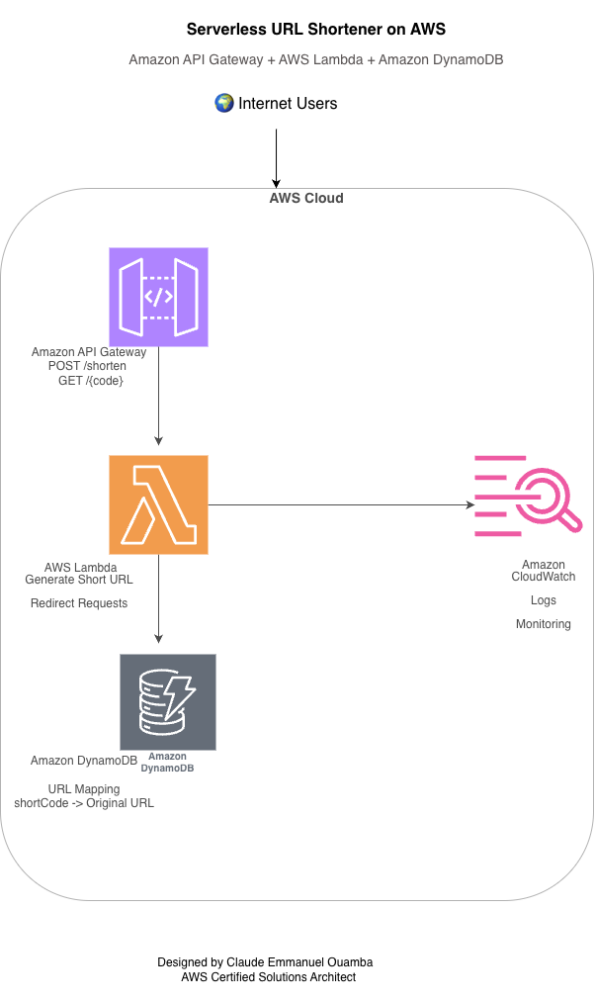

# Project 02: Serverless URL Shortener on AWS

## Quick Facts

| Property | Value |
|----------|-------|
| Status | ✅ Completed |
| Architecture | Serverless |
| Region | us-east-2 |
| Runtime | Python 3.13 |
| API Type | HTTP API |
| Database | Amazon DynamoDB |

## 📑 Table of Contents

- Project Overview
- AWS Services Used
- Learning Objectives
- Architecture
- Features
- API Endpoints
- Screenshots
- Deployment Summary
- Security Best Practices
- Estimated Cost
- Cleanup
- Lessons Learned
- Future Improvements
- Author

## 📖 Project Overview

This project demonstrates how to build a production-ready serverless URL shortener on AWS using modern cloud-native services.

Users can submit a long URL through an HTTP API. AWS Lambda generates a unique short code, stores the mapping in Amazon DynamoDB, and returns the shortened URL. When users visit the shortened URL, a second Lambda function retrieves the original URL from DynamoDB and redirects the user.

The project demonstrates serverless application development, REST APIs, Infrastructure as a Service (FaaS), and AWS best practices.

---

## 🚀 Project Status

✅ Completed

---

## ☁️ AWS Services Used

| Service | Purpose |
|----------|---------|
| Amazon API Gateway | Exposes HTTP endpoints |
| AWS Lambda | Serverless backend logic |
| Amazon DynamoDB | Stores URL mappings |
| AWS IAM | Secure permissions |
| Amazon CloudWatch | Logs and monitoring |

---

## 🎯 Learning Objectives

By completing this project I learned how to:

- Build serverless applications
- Create HTTP APIs using API Gateway
- Develop AWS Lambda functions using Python
- Store application data in DynamoDB
- Configure IAM permissions
- Monitor Lambda using CloudWatch
- Build REST APIs
- Design production-ready AWS architectures

---

## 🏗️ Architecture

---

## ✨ Features

- ✅ Serverless architecture
- ✅ Create short URLs
- ✅ Redirect users automatically
- ✅ REST API
- ✅ HTTP API
- ✅ DynamoDB persistence
- ✅ CloudWatch logging
- ✅ Auto scaling
- ✅ Pay-per-request pricing

--- 

## 📌 API Endpoints

| Method | Endpoint | Description |
|---------|----------|-------------|
| POST | /shorten | Creates a short URL |
| GET | /{code} | Redirects to the original URL |

---

## 🚀 Deployment Summary

The deployment included:

1. Creating a DynamoDB table
2. Creating the createShortUrl Lambda function
3. Creating the redirectUrl Lambda function
4. Configuring IAM permissions
5. Deploying Lambda functions
6. Creating an HTTP API Gateway
7. Configuring API routes
8. Deploying the API
9. Testing both endpoints
10. Monitoring execution using CloudWatch

---

## 🔒 Security Best Practices

- IAM roles used for Lambda permissions
- No hardcoded AWS credentials
- HTTP API integrated securely with Lambda
- Serverless architecture reduces attack surface
- CloudWatch logs enabled for monitoring

--- 

## 💰 Estimated Cost

This project is eligible for the AWS Free Tier for many users.

Typical monthly cost under low usage:

| Service | Estimated Cost |
|----------|----------------|
| API Gateway | Free or very low |
| AWS Lambda | Free or very low |
| DynamoDB | Free or very low |
| CloudWatch | Free or very low |

--- 

## 📚 Lessons Learned

During this project I learned how to:

- Design a serverless architecture
- Build REST APIs with API Gateway
- Write Python Lambda functions
- Store application data in DynamoDB
- Configure IAM permissions
- Troubleshoot AWS services
- Monitor applications using CloudWatch

--- 

## 🚀 Future Improvements

- Custom domain using Route 53
- HTTPS certificate using ACM
- Deploy infrastructure using Terraform
- CI/CD pipeline with GitHub Actions
- URL expiration feature
- QR code generation
- Analytics dashboard
- User authentication

--- 

## 🧹 Cleanup

To avoid unnecessary AWS charges:

1. Delete the API Gateway
2. Delete the Lambda functions
3. Delete the DynamoDB table
4. Delete CloudWatch log groups (optional)

---

## 👨‍💻 Author

**Claude Emmanuel Ouamba**

Cloud & DevOps Engineer

### 🏅 Certifications

- AWS Certified Solutions Architect – Associate
- AWS Certified Cloud Practitioner
- HashiCorp Certified: Terraform Associate

### 🌐 Connect with Me

- GitHub: https://github.com/emmacl5
- LinkedIn: https://www.linkedin.com/in/claude-emmanuel-ouamba-418421116/

